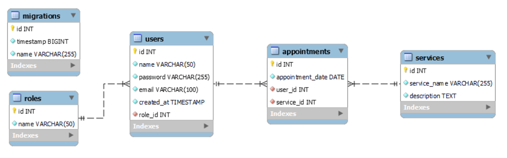

# Tattoo Shop  React Frontend
Hello, welcome to the tattoo shop front end, its the 6th project at GeeksHubs Academy consisting in the frontent made with React of the 4th project. 
The navigation is very simple, just loggin or register if you dont have an account select a service and create an appointment.

🛠️FRONT-END STACK: 

🛠️BACK-END STACK: 

## Installation and usage

Before installing make sure you already have the backend and database from the  project: [Here](https://github.com/HyPolDev/Tattoo-Shop_Week-4-Project)

##### Instalation (local)
1.  Clone this repository
2.  Run ` $ npm install ` in terminal
3.  Connect repository with database 
4.  `$ npm run dev`

## ✒️ Autor

- **Pol Montero** - Project Developer
  - [GitHub](https://github.com/hypoldev) 

## 🎓 Special Thanks

- To **Geekshubs Academy** for the trust, encouragement and knowledges to make me able to develop this first project.

